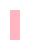
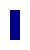
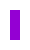
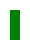

# Oppgave

1. [x] Last ned og pakk ut mappen med oppgavene fra ItsLearning
2. [X] Opprett ett GitHub-repo der filene i denne mappen er med.
3. [X] Tenk gjennom versjonskontroll og at det er en av tingene som vil bli vurdert
4. [X] Del repoet med `EJDahle` og med `runelanghelle`
5. [X] Sørg for at repoet er åpnet i VS Code
6. [X] Velg tema fra temalisten under - du kan velge egne farger til fargepaletten, men det må passe til temaet du velger. Du kan ha flere eller færre farger. Husk at endring av lightness i HSL-instillingene regnes som samme farge.
7. [X] Før fargene du velger inn i `stilvalg/README.md`. Pass på at svg-filene `stilvalg/svg/farge1-5` med rette farger. Denne filen skal alltid være oppdatert med rett fargepalett.
8. [X] Velg en font som passer til tema. Bruk Google eller Creative Cloud fonter.
9. [X] Før fargene inn som variabler i CSS filen `nettside/assets/style.css`
10. [X] Bruk variablene til å få skape et helhetlig uttrykk på nettsiden.  
11. [X] Nettsiden skal tilpasses bruk på datamaskin-skjerm med størrelse 1920&#xd7;1080 (bredde&#xd7;høyde)
12. [ ] Nettsiden skal tilpasses mobil med størrelse 414&#xd7;896 (bredde&#xd7;høyde)

---

# Tema

- <b>Rosablogg</b> – Nyanser av rosa og pastellfarger.
  -  #FFC0CB,  #FFB6C1,  #FFDAB9,  #E6E6FA,  #98FF98
- <b>Miljøorganisasjon</b> – Grønne toner, jordfarger og naturinspirerte nyanser.
  -  #228B22 #6B8E23 #8B4513 #87CEEB #FFD700
- <b>Teknologibedrift</b> – Kule blåtoner, grått og metalliske farger.
  -  #4169E1 #708090 #C0C0C0 #00008B #E0FFFF
- <b>Retro 80-talls</b> – Lyse neonfarger og kontrastfulle kombinasjoner.
  -  #FF6EC7 #1B03A3 #9400D3 #FF5F1F #FFFF33
- <b>Havtema</b> – Blåtoner, turkis og sandfarger.
  -  #006994 #40E0D0 #F4A460 #2E8B57 #FF7F50
- <b>Solnedgang</b> – Varme oransje, røde og lilla nyanser.
  -  #FF4500 #FFA500 #8B0000 #800080 #FF00FF
- <b>Vintage sepia</b> – Bruntoner, krem og dempede farger.
  -  #704214 #FFFDD0 #A0522D #F5F5DC #483C32
- <b>Eventyr/Fantasy</b> – Mystiske lilla, dype blåtoner og sølv.
  -  #4B0082 #191970 #C0C0C0 #00CED1 #FF1493
- <b>Sportslag</b> – Farger basert på et bestemt lag eller sport.
  -  #FF0000 #FFFFFF #000000 #FFD700 #000080
- <b>Helse og velvære</b> – Beroligende pastellfarger og myke toner.
  -  #77DD77 #ADD8E6 #FFB6C1 #E6E6FA #FFE5B4
- <b>Barnehage</b> – Lyse primærfarger og lekne kombinasjoner.
  -  #FF0000 #0000FF #FFFF00 #008000 #FFA500
- <b>Kunstgalleri</b> – Monokrome farger eller dristige kontraster.
  -  #000000 #FFFFFF #808080 #FF0000 #00008B
- <b>Kaffebar</b> – Varme bruntoner, krem og gyldne nyanser.
  -  #654321 #6F4E37 #FFFDD0 #D4AF37 #C68E17
- <b>Dyrevernorganisasjon</b> – Naturlige jordfarger og grønne toner.
  -  #228B22 #8B4513 #87CEEB #FFD700 #F5F5DC
- <b>Space/Sci-Fi</b> – Mørke bakgrunner med lyse neonaksenter.
  -  #000000 #1B03A3 #9400D3 #C0C0C0 #7DF9FF
- <b>Sommerfestival</b> – Livlige og energiske farger som gul, rosa og turkis.
  -  #FFFFE0 #FF69B4 #40E0D0 #32CD32 #FFA500
- <b>Minimalistisk</b> – Svart, hvitt og forskjellige gråtoner.
  -  #000000 #FFFFFF #D3D3D3 #A9A9A9 #36454F
- <b>Urban Street Art</b> – Graffiti-inspirerte farger med dristige kontraster.
  -  #FF6EC7 #32CD32 #00BFFF #FFA500 #800080
- <b>Gullsmed</b> – Gull, sølv og edelstensfarger som rubin og safir.
  -  #D4AF37 #C0C0C0 #9B111E #0F52BA #50C878
- <b>Musikkblogg</b> – Dype farger som indigo, lilla og svart med neonaksenter.
  -  #4B0082 #800080 #000000 #FF6EC7 #1B03A3